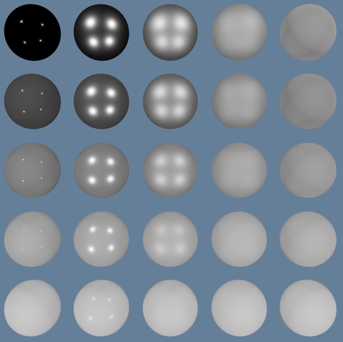
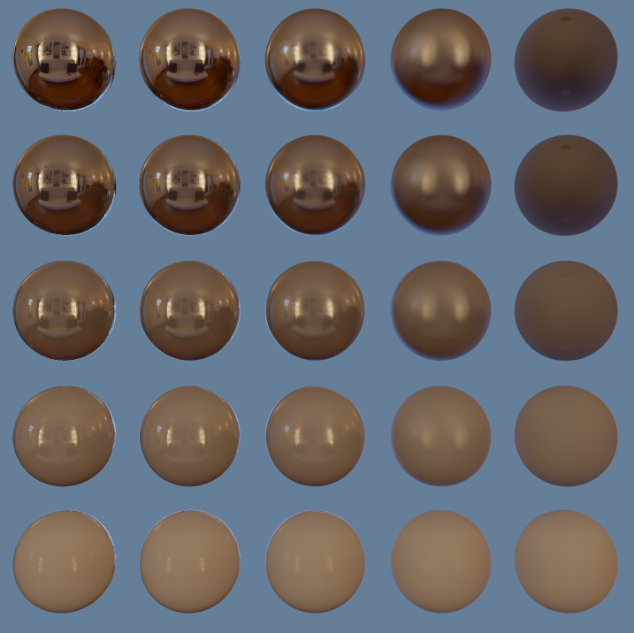
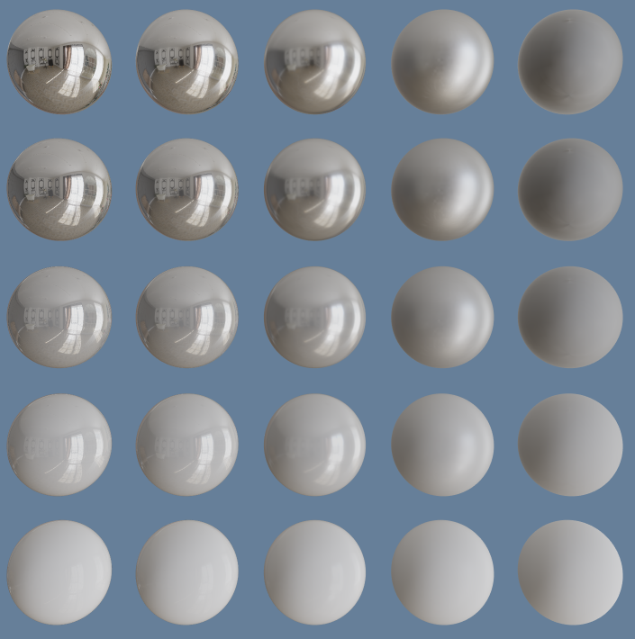
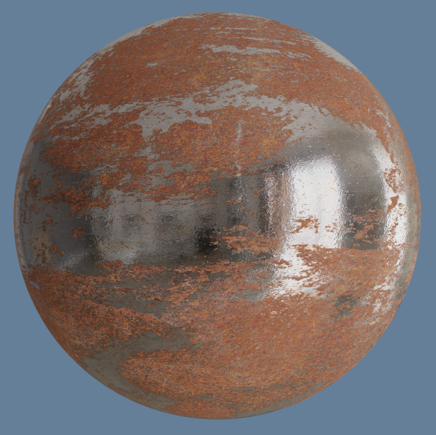

# REPR
## AUTHORS
Guillaume POISSON

Original project skeleton made by David PEICHO at https://github.com/DavidPeicho/Teaching/tree/main/pbr

## Work done

The GUI allows the user to switch between the three main steps of the project: ponctual lights with Lambertian diffuse BRDF and Cook-Torrance GGX Specular BRDF, Image Based Lighting using the given specular and diffuse textures, and specular and diffuse generation using a .exr file available in the assets/env/ folder.

The GUI also allows the user to use or disable the rusted iron texture if they wish to. Besides that, there are minor settings available to change some settings such as the albedo, light intensity, the rotation of the spheres...

### Visualization

If the screenshots don't show directly while visualizing this file, you can see them in the screenshots/ folder.

#### Ponctual Lights

#### IBL Diffuse & Specular

#### Generated Diffuse & Specular IBL

#### Textures

